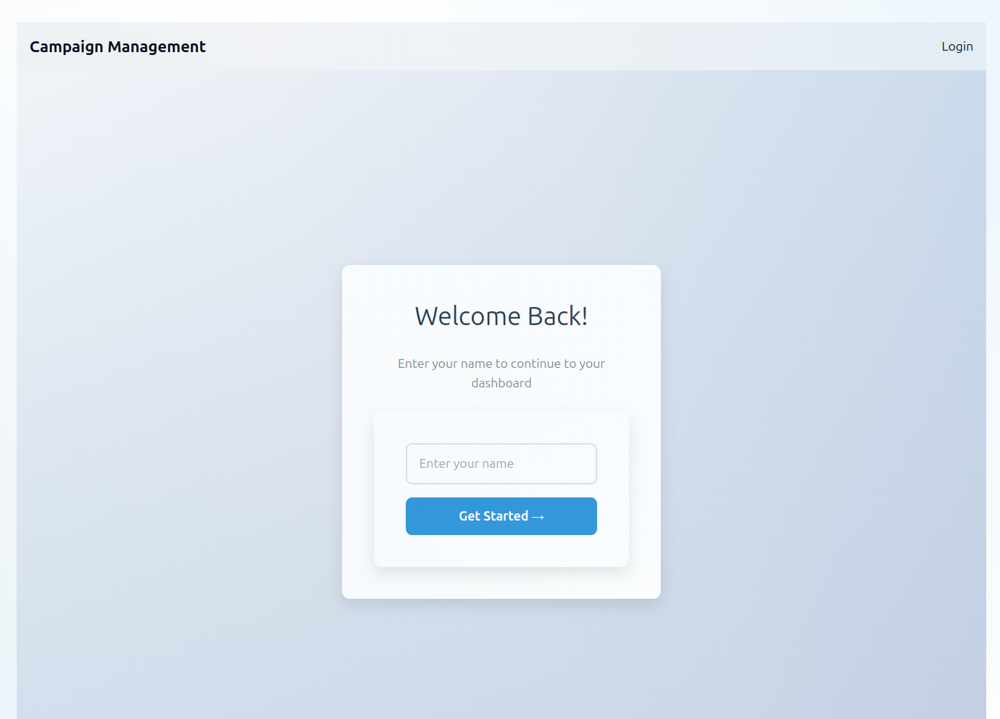
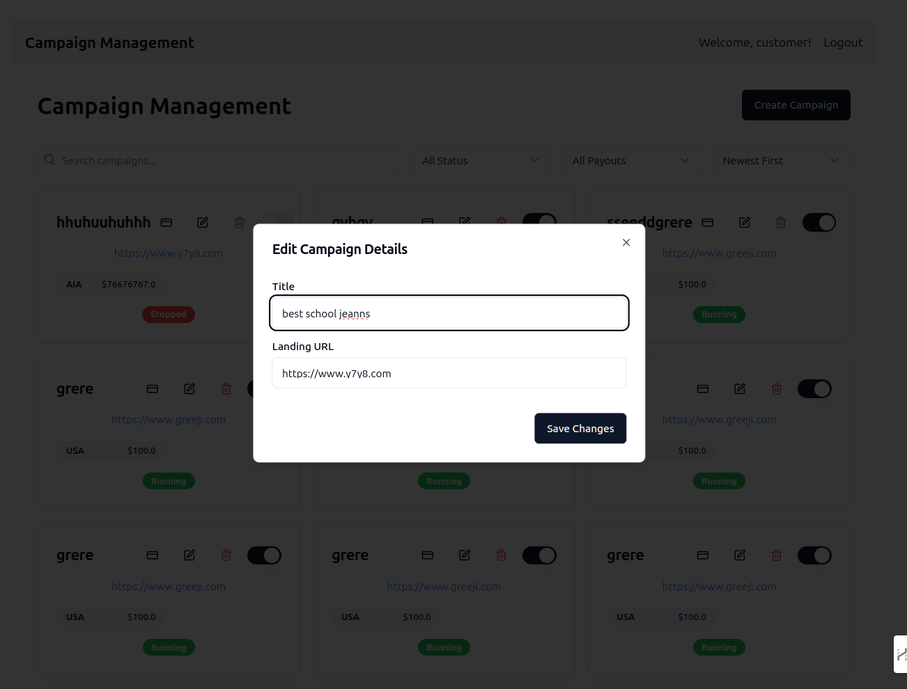
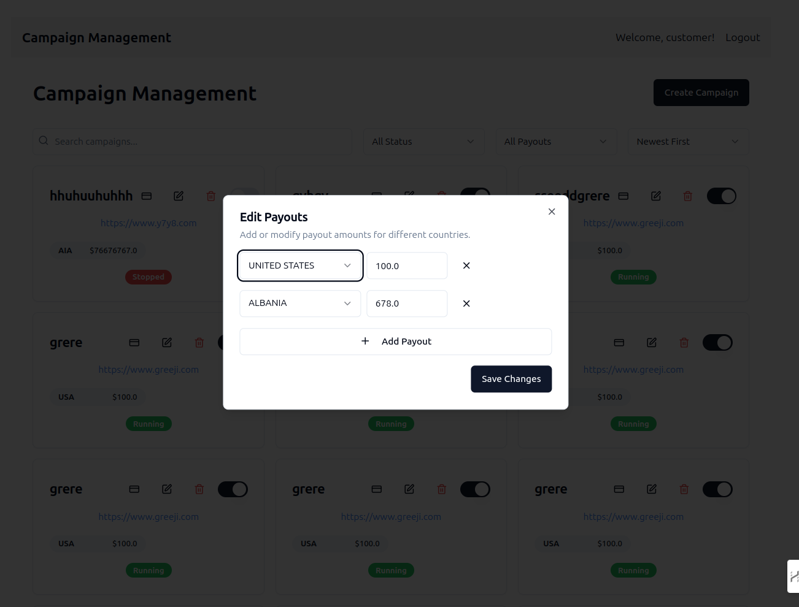
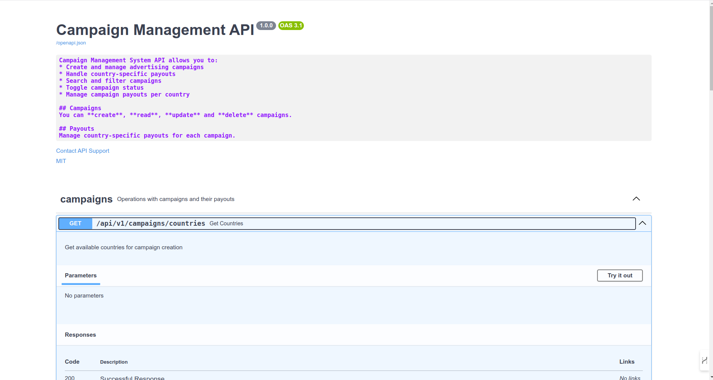
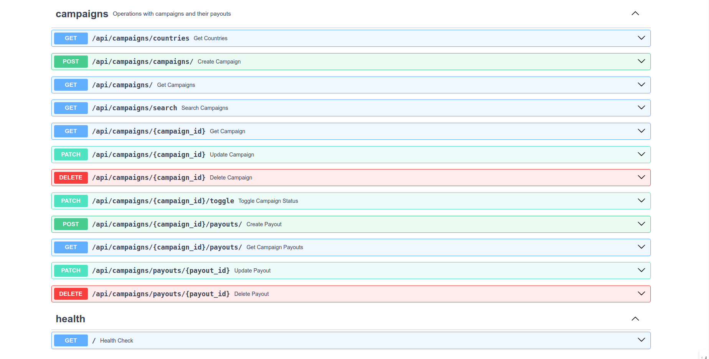
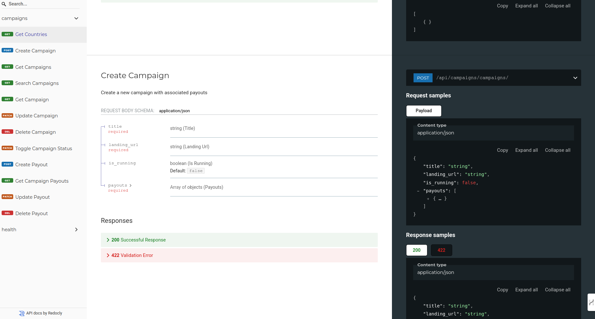

# Campaign Management System Requirements Analysis

## Makefile Commands

### Docker Compose Services
- **up**: Start the Docker Compose services in detached mode.
  ```sh
  make up
  ```
- **down**: Stop the Docker Compose services.
  ```sh
  make down
  ```
- **build**: Build the Docker Compose services.
  ```sh
  make build
  ```

### Testing
- **test**: Run the backend tests using pytest.
  ```sh
  make test
  ```

### Backend
- **backend**: Set up and run the backend service.
  ```sh
  make backend
  ```

### Frontend
- **frontend**: Set up and run the frontend service.
  ```sh
  make frontend
  ```



## 1. Business Requirements Table

| ID | Category | Requirement | Priority |
| --- | --- | --- | --- |
| BR1 | Campaign Creation | System must allow creation of advertising campaigns with title and landing page URL | High |
| BR2 | Payout Management | System must support multiple payouts per campaign based on different countries | High |
| BR3 | Campaign Control | System must allow toggling campaign status between running and stopped | High |
| BR4 | Campaign Discovery | System must provide searchable list of all campaigns | High |
| BR5 | Data Validation | System must ensure all mandatory fields are filled and valid | High |
| BR6 | Search Capability | System must allow searching by title, URL, and running status | Medium |
| BR7 | Data Management | System must maintain accurate payout records per country | High |
| BR8 | User Interface | System must provide intuitive interface for campaign management | Medium |



## 2. User Journeys Table

| Journey ID | User Goal | Steps | Expected Outcome |
| --- | --- | --- | --- |
| UJ1 | Create New Campaign | 1. Navigate to campaign creation<br>2. Enter campaign title<br>3. Enter landing page URL<br>4. Add country-specific payouts<br>5. Submit campaign | New campaign created and listed |
| UJ2 | Manage Campaign Status | 1. Find campaign in list<br>2. Toggle running status<br>3. Confirm change | Campaign status updated |
| UJ3 | Search Campaigns | 1. Access campaign list<br>2. Enter search criteria<br>3. View filtered results | Relevant campaigns displayed |
| UJ4 | Add Payouts | 1. Select campaign<br>2. Add new payout<br>3. Specify country and amount<br>4. Save changes | Payout added to campaign |
| UJ5 | View Campaign Details | 1. Browse campaign list<br>2. Select specific campaign<br>3. View all details | Complete campaign information displayed |


## 3. Functional Requirements Table

| ID | Feature | Description | Acceptance Criteria |
| --- | --- | --- | --- |
| FR1 | Campaign Creation | Create new advertising campaign | - Title field (mandatory)<br>- Landing page URL (mandatory)<br>- At least one payout<br>- Validation of URL format |
| FR2 | Campaign Listing | Display list of all campaigns | - Show title<br>- Show URL<br>- Show payouts<br>- Pagination<br>- Sorting options |
| FR3 | Campaign Search | Search functionality | - Search by title<br>- Search by URL<br>- Filter by status<br>- Real-time results |
| FR4 | Status Management | Toggle campaign status | - Binary status (running/stopped)<br>- Immediate effect<br>- Visual status indicator |
| FR5 | Payout Management | Handle country-specific payouts | - Multiple payouts per campaign<br>- Country selection<br>- Amount validation<br>- Currency handling |
| FR6 | Data Validation | Validate all inputs | - URL format checking<br>- Required field validation<br>- Payout amount validation |
| FR7 | Error Handling | Handle system errors | - User-friendly error messages<br>- Input validation feedback<br>- System error handling |
| FR8 | Data Persistence | Store campaign data | - Database storage<br>- Data consistency<br>- Backup capability |



## 4. Non-Functional Requirements Table

| ID | Category | Requirement | Metric |
| --- | --- | --- | --- |
| NFR1 | Performance | Page load time | < 2 seconds |
| NFR2 | Scalability | Concurrent users | Support 100 simultaneous users |
| NFR3 | Availability | System uptime | 99.9% uptime |
| NFR4 | Security | Data protection | - HTTPS encryption<br>- Input sanitization<br>- SQL injection prevention |
| NFR5 | Usability | User interface | - Intuitive navigation<br>- Mobile responsive<br>- Consistent design |
| NFR6 | Maintainability | Code quality | - Documentation<br>- Clean code<br>- Version control |
| NFR7 | Reliability | Error rate | < 0.1% error rate |
| NFR8 | Compatibility | Browser support | Support latest versions of major browsers |



## 5. Development Phases Table

| Phase | Features | Duration | Dependencies |
| --- | --- | --- | --- |
| 1 | Basic Campaign CRUD | Week 1 | None |
| 2 | Payout Management | Week 1 | Phase 1 |
| 3 | Search & Filter | Week 2 | Phase 1 |
| 4 | Status Management | Week 2 | Phase 1 |
| 5 | Testing & Security | Week 3 | All previous phases |
| 6 | Deployment & Documentation | Week 3 | All previous phases |



## 6. Success Criteria Table

| ID | Criteria | Measurement |
| --- | --- | --- |
| SC1 | Campaign Creation | Users can successfully create campaigns with required fields |
| SC2 | Search Functionality | Users can find campaigns using different search criteria |
| SC3 | Payout Management | Multiple payouts can be added and managed per campaign |
| SC4 | System Performance | System maintains performance under specified load |
| SC5 | User Satisfaction | Positive user feedback on interface and functionality |

# Campaign Management System Test Plan

## 1. Test Strategy Overview Table

| Aspect | Description | Tools/Methods |
| --- | --- | --- |
| Unit Testing | Test individual components and functions | Jest (Frontend), Pytest (Backend) |
| Integration Testing | Test API endpoints and data flow | Postman, Pytest |
| UI Testing | Test user interface and interactions | React Testing Library, Cypress |
| Performance Testing | Test system under load | k6, Artillery |
| Security Testing | Test system security measures | OWASP ZAP, SonarQube |

## 2. Unit Test Cases

### 2.1 Backend Test Cases

| Test ID | Component | Test Case | Expected Result | Priority |
| --- | --- | --- | --- | --- |
| UT-B1 | Campaign Creation | Create campaign with valid data | Campaign created successfully | High |
| UT-B2 | Campaign Creation | Create campaign without title | Validation error returned | High |
| UT-B3 | Campaign Creation | Create campaign with invalid URL | URL validation error | High |
| UT-B4 | Payout Validation | Add payout with negative amount | Validation error returned | High |
| UT-B5 | Campaign Search | Search with empty string | Return all campaigns | Medium |
| UT-B6 | Campaign Search | Search with specific title | Return matching campaigns | Medium |
| UT-B7 | Status Toggle | Toggle campaign status | Status updated successfully | High |
| UT-B8 | Payout Management | Add multiple payouts | All payouts saved correctly | High |

### 2.2 Frontend Test Cases

| Test ID | Component | Test Case | Expected Result | Priority |
| --- | --- | --- | --- | --- |
| UT-F1 | Campaign Form | Submit with all valid data | Form submits successfully | High |
| UT-F2 | Campaign Form | Submit without required fields | Display validation errors | High |
| UT-F3 | Payout Form | Add multiple payouts | Payouts added to form | High |
| UT-F4 | Campaign List | Load campaign list | Display campaigns correctly | High |
| UT-F5 | Search Component | Enter search term | Filter results accordingly | Medium |
| UT-F6 | Status Toggle | Click status toggle | Update UI and make API call | High |
| UT-F7 | Error Display | Handle API error | Show error message | Medium |
| UT-F8 | Loading States | Show loading indicators | Display loading states | Low |

## 3. Integration Test Cases

| Test ID | Scenario | Steps | Expected Result | Priority |
| --- | --- | --- | --- | --- |
| IT-1 | Complete Campaign Creation | 1. Submit campaign form<br>2. Verify API call<br>3. Check database<br>4. Verify response | Campaign saved in database | High |
| IT-2 | Campaign Update Flow | 1. Modify campaign<br>2. Submit changes<br>3. Verify updates | Changes reflected in system | High |
| IT-3 | Search Integration | 1. Enter search term<br>2. Verify API call<br>3. Check results | Correct results returned | Medium |
| IT-4 | Status Toggle Flow | 1. Toggle status<br>2. Verify API call<br>3. Check database | Status updated correctly | High |
| IT-5 | Payout Management | 1. Add payouts<br>2. Verify API call<br>3. Check database | Payouts saved correctly | High |

## 4. UI/UX Test Cases

| Test ID | Feature | Test Steps | Expected Result | Priority |
| --- | --- | --- | --- | --- |
| UI-1 | Responsive Design | Test on different screen sizes | Proper layout on all devices | High |
| UI-2 | Form Validation | Test all form validations | Clear error messages | High |
| UI-3 | Loading States | Check loading indicators | Proper loading feedback | Medium |
| UI-4 | Error Handling | Test error scenarios | User-friendly error messages | High |
| UI-5 | Navigation | Test all navigation paths | Smooth navigation flow | Medium |

## 5. Performance Test Cases

| Test ID | Scenario | Test Parameters | Acceptance Criteria | Priority |
| --- | --- | --- | --- | --- |
| PT-1 | Page Load | 100 concurrent users | < 2s response time | High |
| PT-2 | Campaign Creation | 50 concurrent submissions | < 3s response time | High |
| PT-3 | Search Function | 200 search requests/minute | < 1s response time | Medium |
| PT-4 | Database Load | 1000 campaign records | < 2s query time | Medium |
| PT-5 | API Endpoints | 500 requests/minute | < 1s response time | High |

## 6. Security Test Cases

| Test ID | Security Aspect | Test Case | Expected Result | Priority |
| --- | --- | --- | --- | --- |
| ST-1 | Input Validation | Test SQL injection attempts | Requests blocked | High |
| ST-2 | XSS Prevention | Test script injection | Scripts sanitized | High |
| ST-3 | Rate Limiting | Exceed rate limits | Requests throttled | Medium |
| ST-4 | URL Validation | Test malicious URLs | URLs validated | High |
| ST-5 | API Security | Test unauthorized access | Access denied | High |

## 7. Test Execution Plan

### 7.1 Test Phases Timeline

| Phase | Duration | Focus Areas | Dependencies |
| --- | --- | --- | --- |
| Unit Testing | Week 1 | Individual components | None |
| Integration Testing | Week 2 | Component interaction | Unit tests passed |
| UI Testing | Week 2 | User interface | Frontend components ready |
| Performance Testing | Week 3 | System performance | Full system integration |
| Security Testing | Week 3 | Security measures | Full system deployment |

### 7.2 Test Environment Requirements

| Environment | Purpose | Configuration |
| --- | --- | --- |
| Development | Unit testing | Local setup |
| Staging | Integration testing | Cloud deployment |
| QA | User acceptance | Production-like |
| Performance | Load testing | Scaled environment |

## 8. Test Reporting Template

| Aspect | Details to Include |
| --- | --- |
| Test Summary | - Total tests executed<br>- Pass/Fail ratio<br>- Critical issues found |
| Issue Details | - Issue description<br>- Severity<br>- Steps to reproduce |
| Performance Metrics | - Response times<br>- Error rates<br>- Resource usage |
| Coverage Report | - Code coverage<br>- Feature coverage<br>- Test completion status |